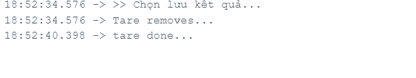
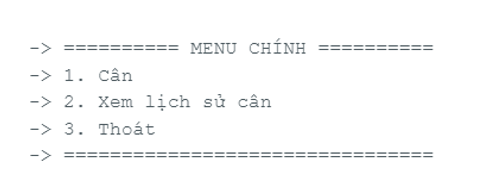

## TÁC GIẢ

- **Họ tên sinh viên**: Nguyễn Bá Hoàng
- **Mã Số Sinh Viên**: 20225844
- **Giảng viên hướng dẫn**: Nguyễn Đức Tiến

## GIỚI THIỆU

 - Đây là một hệ thống cân điện tử được xây dựng với mục tiêu đo và hiển thị trọng lượng một cách chính xác, đồng thời hỗ trợ lưu trữ lịch sử cân kèm thời gian thực. Người dùng có thể tương tác với hệ thống thông qua giao tiếp đơn giản trên máy tính. Ngoài ra, thiết bị còn được tích hợp chế độ tiết kiệm năng lượng, giúp giảm tiêu thụ điện khi không có thao tác và có thể tự động đánh thức khi phát hiện tác động từ môi trường.

 - Ảnh chụp sản phẩm:  

  

<em>Hình 1: Ảnh sản phẩm</em>

## MÔI TRƯỜNG HOẠT ĐỘNG
**Thiết kế phần cứng:**
Hệ thống sử dụng bộ vi điều khiển ESP32 làm trung tâm điều khiển, kết nối với các ngoại vi như cảm biến trọng lượng (Load Cell + HX711), mô-đun thời gian thực (DS3231), bộ nhớ EEPROM (24C32) và cảm biến rung (SW420). Ngoài ra, màn hình LCD I2C được dùng để hiển thị kết quả cân. Tất cả các thành phần được liên kết qua các giao tiếp phổ biến như I2C nhằm đảm bảo khả năng mở rộng và tích hợp dễ dàng.

**Thiết kế phần mềm:**
Chức năng của hệ thống được điều khiển thông qua các hàm xử lý và thư viện lập trình chuẩn của adruino. Phần mềm đảm nhiệm các tác vụ như khởi tạo và đọc dữ liệu từ cảm biến, hiển thị kết quả lên LCD, ghi và đọc dữ liệu từ EEPROM, quản lý thời gian thực và giao tiếp serial với người dùng. Bên cạnh đó, hệ thống còn tích hợp chế độ tiết kiệm năng lượng (SLEEP mode) và cơ chế đánh thức tự động khi có tín hiệu từ cảm biến rung.

## SO ĐỒ SCHEMATIC

  

<em>Hình 2: Mô phỏng kết nối</em>

- **LCD I2C**
  | Module ngoại vi | ESP32 |
  |------------------|-------|
  | VCC              | 5V    |
  | GND              | GND   |
  | SDA              | D21   |
  | SCL              | D22   |

- **SW420**  
  | Module ngoại vi | ESP32 |
  | --------------- | ----- |
  | VCC             | 5V    |
  | GND             | GND   |
  | D0              | D33   |

- **DS3231** 
  | Module ngoại vi | ESP32 |
  | --------------- | ----- |
  | VCC             | 3.3V  |
  | GND             | GND   |
  | SDA             | D21   |
  | SCL             | D22   |

- **HX711**  
  | Module ngoại vi | ESP32 |
  | --------------- | ----- |
  | VCC             | 5V    |
  | GND             | GND   |
  | DT (Data)       | D19   |
  | SCK (Clock)     | D18   |

## HƯỚNG DẪN CÀI ĐẶT VÀ CHẠY THỬ
1. **Cài đặt môi trường**
- Cài đặt Arduino IDE (nên dùng bản mới nhất): 
[Cài đặt IDE Arduino](https://www.arduino.cc/en/software/)

- Vào **Tools > Board > Board Manager**  → Tìm và cài **ESP32** của Espressif

- Chọn **Board** là **ESP32-WROOM-DA Module**

2. **Cài đặt thư viện cần thiết**
- Vào **Tools > Manage Libraries**

- Tìm và cài: **LCD-I2C (của Frank Hafele)**  

  

<em>Hình 3: I2C-lib</em>

- *Ngoài thư viện trên, các thư viện còn lại đã có sẵn trong môi trường IDE*

3. **Chạy thử chương trình**
- Kết nối phần cứng như đã mô tả ở phần **SƠ ĐỒ SCHEMATIC**
- Cắm **ESP32** vào máy tính qua cổng USB
- Mở project .ino trong Arduino IDE
- Chọn:
  - **Board:** ESP32-WROOM-DA Module
  - **Port:** Cổng COM tương ứng mà IDE hiện lên 

  

<em>Hình 4: Chọn board và thiết bị</em>

- **Verify** chương trình  

  

<em>Hình 5: Verify</em>

- **Upload** chương trình (Ctrl + U)  

  

<em>Hình 6: Upload</em>

- Mở **Serial Monitor** (baud 115200) để xem log.  

  

<em>Hình 7: Serial Monitor</em>

4. **Vận hành thiết bị**  
- Khi bật nguồn / reset: Thiết bị sẽ hiển thị menu chọn chế độ.

  

<em>Hình 8: Menu chọn chế độ</em>

- Dùng Serial Monitor để nhập lệnh: Nhập lệnh số 1 trên thanh nhập lệnh để vào chọn chế độ cân.

  

<em>Hình 9: Menu chế độ cân</em>

- Chọn chức năng cân có lưu log: Nhập tiếp lệnh số 1 để chọn chức năng này.

- Đặt vật lên cân: Sau khi chờ hệ thống hiệu chuẩn cân , đặt thử một vật bất kỳ lên mặt cân.

  - Chờ hệ thống hiệu chuẩn xong:
  

  
  
  
  
<em>Hình 10: Wait tare</em>

  - Đặt vật lên mặt cân và chờ kết quả:
  

  
  
  
  
<em>Hình 11: Cân và chờ kết quả</em>

- Lựa chọn xem lịch sử cân: Sau khi cân xong, ta có thể xem lại kết quả cân nếu trước đó đã chọn chức năng cân có lưu lịch sử

  - Chọn xem lịch sử: Nhập lệnh số 2 ở giao diện menu chính.
  

  
  
  
  
<em>Hình 12: Lựa chọn xem lịch sử</em>

  - Kết quả:  
  

  
  
  
  
<em>Hình 13: Kết quả cân</em>

5. **Lưu ý**
- Tránh rung lắc trong lúc cân để đảm bảo kết quả chính xác
- Nếu dùng pin ngoài, hãy kiểm tra dòng tải đủ cho ESP32 + HX711 + OLED + LCD

## NGUYÊN LÝ CƠ BẢN
1. **Giới thiệu tổng quan:**   

**Phần cứng:**  

  

<em>Hình 14: Mô tả phần cứng tổng quan</em>

- Hệ thống cân điện tử được thiết kế dựa trên nền tảng vi điều khiển ESP32 và một số cảm biến, ngoại vi hỗ trợ cho việc thu thập dữ liệu, xử lý và hiển thị. Các thành phần phần cứng được kết nối và phối hợp hoạt động để đảm bảo thiết bị hoạt động chính xác, ổn định, đồng thời hỗ trợ các chức năng như hiển thị trọng lượng, ghi log dữ liệu và tiết kiệm năng lượng. Cụ thể:  
  - **ESP32**: đóng vai trò là bộ xử lý trung tâm (MCU), thực hiện tất cả các thao tác xử lý tín hiệu, giao tiếp ngoại vi, điều khiển hiển thị, lưu trữ và quản lý trạng thái hệ thống. Các chân GPIO và I2C của vi điều khiển được cấu hình để giao tiếp với các thiết bị ngoại vi tương ứng.  
  - **Load Cell 50kg**: là cảm biến đo trọng lượng sử dụng nguyên lý biến dạng điện trở. Khi có vật đặt lên, lực tác động sẽ làm thay đổi điện trở trong Load Cell và tạo ra một tín hiệu điện áp nhỏ (mức millivolt), cần khuếch đại trước khi xử lý.  
  - **HX711:** là một bộ khuếch đại tín hiệu và chuyển đổi ADC 24-bit, được thiết kế chuyên dụng cho Load Cell. Nó nhận tín hiệu analog từ Load Cell, khuếch đại và chuyển đổi thành tín hiệu số để truyền về ESP32.  
  - **DS3231 (RTC):** là mô-đun đồng hồ thời gian thực có độ chính xác cao, giúp hệ thống lưu lại chính xác thời điểm cân (ngày, giờ, phút, giây) cho từng lần đo. DS3231 giao tiếp với vi điều khiển thông qua giao thức I2C.  
  - **EEPROM AT24C32:** là bộ nhớ lưu trữ dạng flash không mất dữ liệu khi mất nguồn. Nó được sử dụng để lưu trữ lịch sử các lần cân nhằm phục vụ việc truy xuất dữ liệu sau này. Thiết bị này cũng sử dụng giao tiếp I2C.  
  - **Cảm biến rung SW420:** được sử dụng như một công tắc cảm biến rung hoặc chấn động. Thiết bị phát hiện các dao động nhẹ như rung tay hoặc nhấn nút và gửi tín hiệu đánh thức MCU từ chế độ tiết kiệm năng lượng (SLEEP mode).  

**Phần mềm:**  

  

<em>Hình 15: Mô tả phần mềm tổng quan</em>

- Phần mềm của hệ thống cân điện tử được chia thành nhiều mô-đun riêng biệt nhằm tách biệt chức năng, giúp dễ dàng mở rộng và bảo trì. Mỗi mô-đun đảm nhận một vai trò cụ thể trong toàn bộ chu trình xử lý – từ thu thập dữ liệu, giao tiếp người dùng đến quản lý tiết kiệm năng lượng và hiển thị thông tin. Các mô-đun được tổ chức như sau:  
  - **can_dien_tu_v1.ino:** Đây là chương trình chính, thực hiện khởi tạo hệ thống và điều hướng luồng hoạt động giữa các mô-đun. Nó liên kết trực tiếp với các mô-đun xử lý chính như cân, giao tiếp serial, xử lý ghi log và chế độ ngủ.  
  - **scale_process.h:** Quản lý quá trình cân, bao gồm các thao tác đọc dữ liệu từ cảm biến HX711, tính toán khối lượng, hiệu chuẩn và hiển thị kết quả. Mô-đun này còn gọi các hàm từ hx711.h để xử lý tín hiệu ADC và lcd-i2c.h để hiển thị lên màn hình.  
  - **uart_interface.h:** Chịu trách nhiệm giao tiếp với người dùng thông qua UART. Các lệnh điều khiển như “Cân”, “Xem lịch sử”, “Ngủ” được tiếp nhận và phản hồi thông qua giao diện của arduino serial.  
  - **log_process.h:** Xử lý việc ghi và đọc dữ liệu lịch sử từ EEPROM. Mỗi lần đo có thể được lưu lại kèm theo thông tin thời gian, hỗ trợ việc tra cứu lịch sử cân.  
  - **sleep_process.h:** Kiểm soát chế độ tiết kiệm năng lượng. Khi không có tương tác trong một khoảng thời gian định sẵn, mô-đun này sẽ đưa hệ thống vào chế độ SLEEP và đánh thức lại khi có rung.  
  - **hx711.h:** Cung cấp các hàm xử lý tín hiệu từ cảm biến Load Cell, bao gồm đọc giá trị ADC và hiệu chuẩn thông số cân.  
  - **lcd-i2c.h:** Điều khiển màn hình LCD thông qua giao tiếp I2C để hiển thị kết quả cân, thông báo và menu người dùng.  

2. **Nguyên lý vận hành của hệ thống:**  

**Điều khiển giao tiếp các thiết bị**

  

<em>Hình 16: Sơ đồ hoạt động hệ thống tổng quan</em>

- Sơ đồ trên thể hiện tổng quan cấu trúc điều khiển và giao tiếp giữa các thành phần phần mềm trong hệ thống cân điện tử. Người dùng tương tác thông qua giao diện UART hoặc màn hình LCD, từ đó gửi lệnh hoặc nhận dữ liệu từ hệ thống. Tất cả các hoạt động xử lý trung tâm đều được điều phối bởi tiến trình chính là Main Task, đóng vai trò quản lý và phân luồng dữ liệu đến các khối chức năng tương ứng.

- Khi người dùng yêu cầu đo cân, Main Task chuyển lệnh đến Scale Process để xử lý tín hiệu từ cảm biến load cell qua driver HX711. Sau khi có dữ liệu, thông tin được chuyển tiếp đến Log Task, nơi chịu trách nhiệm ghi lại dữ liệu kèm thời gian thực từ DS3231 vào bộ nhớ EEPROM AT24C32. Đồng thời, Display Task nhận dữ liệu cần hiển thị và cập nhật lên LCD Display cho người dùng biết.

**Đo và đọc dữ liệu cân**

  

<em>Hình 17: Sơ đồ xử lý tín hiệu từ HX711</em>

- Quá trình xử lý tín hiệu từ cảm biến trọng lượng được thực hiện theo các bước như sau:
  1. **Đọc giá trị ADC từ HX711**  
  Vi điều khiển thực hiện việc thu thập dữ liệu từ mô-đun HX711, nơi tín hiệu analog từ Load Cell đã được khuếch đại và chuyển đổi thành tín hiệu số (ADC 24-bit). Đây là bước lấy dữ liệu trọng lượng thô từ cảm biến.  
  2. **Tính trung bình nhiều mẫu (lọc nhiễu)**  
  Để giảm nhiễu và tăng độ chính xác, hệ thống tiến hành lấy nhiều mẫu liên tiếp (thường là 10 mẫu) và tính giá trị trung bình. Việc này giúp làm mượt tín hiệu và loại bỏ sai số tức thời.  
  3. **Kiểm tra hệ số hiệu chuẩn (scale)**  
  Trước khi tính toán trọng lượng thực tế, hệ thống cần biết hệ số hiệu chuẩn – được xác định thông qua phép đo với một khối lượng mẫu chuẩn trước đó. Nếu hệ số hiệu chuẩn chưa được thiết lập, hệ thống sẽ không thực hiện phép tính trọng lượng mà quay lại bước thu thập.   
  4. **Trừ offset (Tare)**  
  Giá trị offset là tín hiệu ADC đo được khi không có tải. Việc trừ offset giúp loại bỏ ảnh hưởng của khối lượng bản thân cảm biến hoặc vật đỡ, đảm bảo rằng chỉ có tải trọng thực sự được tính.  
  5. **Tính trọng lượng thực tế**  
  Trọng lượng được tính toán dựa theo công thức:  
  

  
  
  
  
<em>Hình 18: Công thức cân nặng</em>

  *Ta có thể phải lấy giá trị tuyệt đối của kết quả do ta thường bị nối ngược đầu 2 chân tín hiệu A+,A- với 2 dây load cell. Việc này không làm ảnh hưởng đến kết quả đo do nó chỉ làm đảo dấu chứ không thay đổi giá trị cân.*

**Cấu trúc lưu trữ dữ liệu**

  

<em>Hình 19: Cấu trúc lưu trữ trong AT24C32</em>

- Hình ảnh trên mô tả bố cục bộ nhớ EEPROM trong module AT24C32 được sử dụng để lưu trữ các bản ghi cân nặng kèm thời gian trong hệ thống cân điện tử. Cấu trúc bộ nhớ được chia thành ba phần chính:
  1. Byte Flag đánh dấu (1 byte)
     - Địa chỉ: Byte 0 trong EEPROM.
     - Vai trò: Lưu giá trị cờ để đánh dấu việc đã khởi tạo giá trị thời gian ban đầu hoặc dự phòng cho những việc cần đánh dấu sau này.
     - Ý nghĩa: Giúp chương trình phân biệt một số trạng thái đặc biệt (nếu có).

  2. Địa chỉ con trỏ stack (2 byte)
     - Địa chỉ: Byte 1 và Byte 2.
     - Vai trò: Lưu trữ con trỏ ghi dữ liệu hiện tại trong EEPROM (16 bit → 2 byte).
     - Ý nghĩa: Chỉ vị trí ô nhớ tiếp theo sẽ được dùng để lưu bản ghi cân tiếp theo để nếu khởi động lại hệ thống hoặc mất điện thì vẫn xác định được vị trí con trỏ stack.

  3. Vùng dữ liệu (còn lại)
     - Địa chỉ: Bắt đầu từ byte thứ 3 trở đi (4093 byte còn lại).
     - Cách tổ chức: Mỗi bản ghi có kích thước cố định là 11 byte
       - 4 byte cho giá trị trọng lượng (float)
       -	7 byte cho thông tin thời gian (Time struct)

      

      
      
  
      
<em>Hình 20: Cấu trúc ô dữ liệu</em>

**Giao tiếp và ghi dữ liệu**  

  

<em>Hình 21: Biểu đồ trình tự giao tiếp và ghi dữ liệu</em>

- Biểu đồ trình tự trên mô tả quá trình giao tiếp và ghi dữ liệu cân nặng vào bộ nhớ của hệ thống, với sự tham gia của các thành phần chính: Main Task, Log Task, HX711, DS3231 và AT24C32. Luồng hoạt động chi tiết được trình bày như sau:
  1. Main Task gửi yêu cầu ghi dữ liệu bằng lệnh log_request() tới Log Task. Đây là tác vụ chịu trách nhiệm xử lý việc lưu trữ thông tin cân nặng kèm thời gian.
  2. Log Task bắt đầu quy trình bằng cách gọi read_weight() tới HX711 để nhận dữ liệu ADC đã xử lý từ cảm biến Load Cell.
  3. Sau khi nhận trọng lượng, Log Task gửi lệnh get_time() đến DS3231 để lấy thời gian thực, bao gồm ngày, giờ, phút, giây của thời điểm cân.
  4. Dữ liệu trọng lượng và thời gian được kết hợp thành một cấu trúc WeightLog.
  5. Tiếp theo, Log Task giao tiếp với EEPROM (AT24C32) theo thứ tự:
     - read_stack_ptr() để đọc địa chỉ con trỏ hiện tại (vị trí lưu tiếp theo).
     - write_log_entry() để ghi log mới (bao gồm trọng lượng + thời gian).
     - update_stack_ptr() để cập nhật con trỏ sang ô nhớ kế tiếp, sẵn sàng cho lần ghi sau.

## ĐẶC TẢ HÀM
1. **Đo cân nặng**
- Hiệu chỉnh cân:

  

<em>Hình 22: Hàm hiệu chỉnh cân (Tare)</em>

- Đo giá trị cân:

  

<em>Hình 23: Hàm lấy giá trị cân nặng</em>

2. **Lưu giữ liệu**
- Ghi dữ liệu:

  

<em>Hình 24: Hàm ghi dữ liệu vào EEPROM</em>

- Đọc dữ liệu:

  

<em>Hình 25: Hàm đọc dữ liệu từ EEPROM</em>

## KẾT QUẢ
- **Màn hình menu chính:** Màn hình menu chính cho phép người dùng lựa chọn 1 trong 3 chức năng như là tiến hành cân, xem lại lịch sử các lần cân hoặc thoát chương trình.  

  

<em>Hình 26: Hình ảnh menu chính</em>

- **Màn hình tùy chọn cân:** Khi chọn chức năng cân, hệ thống chuyển đến màn hình tùy chọn nơi người dùng có thể:
  - Lưu kết quả vừa đo.
  - Hủy hoặc không lưu kết quả.
  - Trở lại menu chính.

  

<em>Hình 27: Hình ảnh menu cân</em>

- **Màn hình xem lịch sử cân:** Khi chọn xem lịch sử, hệ thống hiển thị danh sách các kết quả cân (bao gồm khối lượng, thời gian và ngày thực hiện). Người dùng có thể:
  - Xóa kết quả gần nhất.
  - Xóa toàn bộ lịch sử.
  - Thoát và quay lại menu chính.

  

<em>Hình 28: Hình ảnh lịch sử cân</em>

- **Phần cứng thực tế:**  

  

<em>Hình 29: Hình ảnh phần cứng thực tế</em>

- **Chi tiết cân:**  

  

<em>Hình 30: Hình ảnh chi tiết cân</em>

